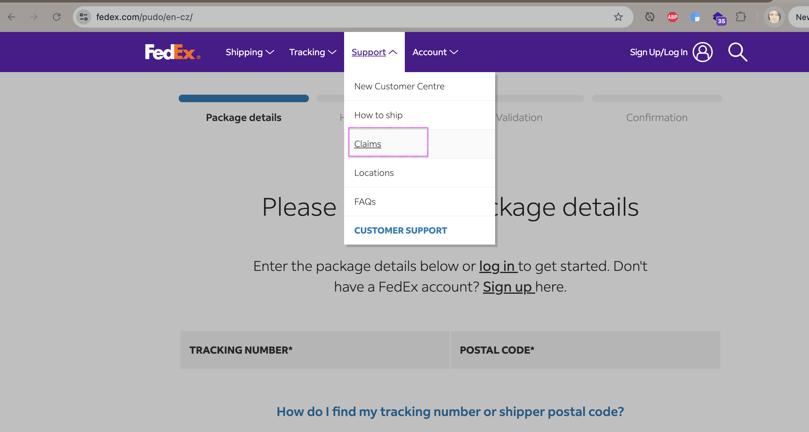
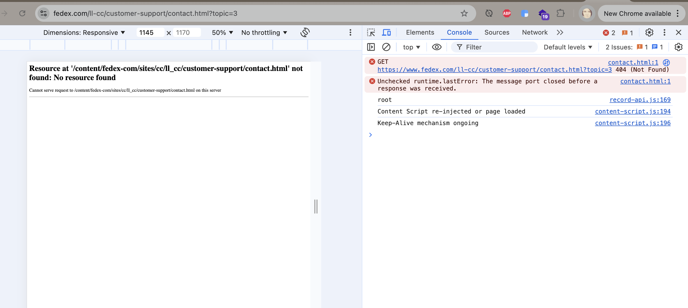

# Case-Study-3

Identify drop-offs and suggest improvements in a User Conversion Flow
Resource: https://www.fedex.com/

## 1. Identify drop-off points:

**Navigation complexity**: Users may find it challenging to locate specific services or contact options due to the extensive range of offerings.

**Form length**: Lengthy or complex forms for inquiries or quotes can deter users from completing them.

**Response time**: Delayed responses to inquiries might lead to user frustration and abandonment.

## 2. Propose improvements:

**Simplify navigation**: Streamline the website's menu to highlight primary services and contact options, reducing the number of clicks required to reach key pages.

**Optimize forms**: Shorten forms by requesting only essential information and consider implementing progressive disclosure to make the process less daunting.

**Enhance response mechanisms**: Implement automated acknowledgments for inquiries and set clear expectations for response times to keep users informed.

## 3. Implement test cases:

**Functionality Testing**: Ensure all links, buttons, and forms function correctly across various devices and browsers.

**Usability Testing**: Conduct user testing sessions to observe interactions and gather feedback on the ease of navigation and form completion.

# Practical example

### **1. Identify drop-off points:**

*This example demonstrates one specific broken link and could be an indicator of similar issues elsewhere*

**Broken links**: For example, I found a broken link that redirects to a 404 error page: [broken link](https://www.fedex.com/ll-cc/customer-support/contact.html?topic=3) When users try to access this customer support page, they encounter an error message that states, "No resource found." This experience may cause users to abandon the site or lose trust in the platform, leading to a potential drop-off.

Steps to reproduce:

1. Go to Fidex web: https://www.fedex.com/pudo/en-cz/
2. Extand Support dropdown on the top menu
3. Click on Claims

*Screenshot of broken link location:*

*Screenshot of 404 error:*

### **2. Propose improvements:**

**Fix broken links:** Ensuring that all links are functional is essential to maintain user trust and prevent drop-offs. This can be achieved by regularly scanning the site for broken links and setting up automatic redirects to relevant pages when content is moved.

### 3. Collaborate for solutions:

To address the broken link issue and improve user retention, I would collaborate with:

* **Developers** : Work with developers to fix the broken link and set up an automated link validation system that regularly scans for broken links across the site, preventing similar issues in the future.
* **UX designers** : Partner with UX designers to ensure the navigation structure clearly guides users to key support pages. This could involve reorganizing menus or adding visual cues to highlight important links, reducing user frustration.
* **Marketers** : Coordinate with marketers to refine the messaging on support-related pages, ensuring that users receive clear guidance and reassurance that they’re on the right path, which can reduce bounce rates and increase trust.

By collaborating with these teams, we can address the immediate issue of the broken link and implement preventive measures to enhance the overall user experience and conversion potential.

### 4. Implement Test Cases (Using Playwright)

To validate the fixes and improvements, I would implement the following test cases with Playwright:

* **Automated link validation** : Set up Playwright to periodically check all critical links on key pages, including the customer support link, to catch any broken links or 404 errors automatically.
* **Navigation testing** : Use Playwright to simulate user journeys through the navigation menu, ensuring that users are directed correctly to support pages without encountering errors.
* **Usability and performance testing** : Implement automated tests in Playwright to measure page load times for the support page and check that interactions (e.g., link clicks) are smooth, validating both usability and performance.

These Playwright test cases help ensure that users can navigate seamlessly without encountering broken links or delays, ultimately improving the reliability and user experience of the site.
